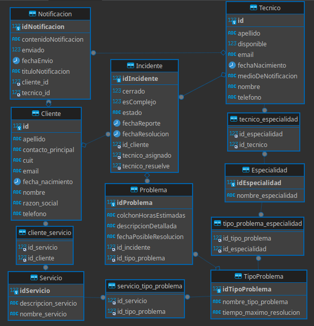

# final-utn-g03

# Sistema de reporte de incidentes

#### Número de comisión: 008.
#### Grupo: 03 y Grupo: 06.
 #### Integrantes:
- German Insaurralde
- Claudio Castro
- Marcos Ezequiel Castillo 
- Anagelica del Valle Estaba Carrasquero
- Cristian Danilo Muñoz Clavijo

## Entidades:

### Cliente
- ID del cliente
- Razón social
- CUIT
- Contacto principal
- Teléfono
- Email
    + contratarServicio(servicio: Servicio)
    + reportarIncidente(detalle: Problema): Incidente

### Operador (Mesa de Ayuda)
- ID del operador
- Nombre
- Apellido
- Teléfono
- Email
- Usuario
- Contraseña
    + registrarIncidente(incidente: Incidente)

### Técnico
- ID del técnico
- Nombre
- Apellido
- Especialidades (relación a tabla de Especialidades)
- Medio de notificación preferido (Email, WhatsApp)
- Tiempo estimado de resolución por defecto
    + asignarIncidente(incidente: Incidente)
    + resolverIncidente(incidente: Incidente)

### Incidente
- ID del incidente
- Fecha de reporte
- Fecha posible de resolución
- Estado del incidente (Abierto, Resuelto)
- Colchón de horas estimadas
    - Técnico asignado (relación a tabla de Técnicos)
    - Cliente (relación a tabla de Clientes)
    - Problemas (relación a tabla de Problema)
    + confirmarIncidente(): void
    + notificarTécnico(): void

### Problema
- ID Problema
- Descripción detallada del problema
- Tipo del problema (relación a tabla de Tipos de Problema)
- Incidente relacionado (relación a tabla de Incidentes)

### Servicio
- ID del servicio
- Nombre del servicio
- Descripción del servicio
- Especialidad

### Especialidad
- ID de la especialidad
- Nombre de la especialidad

### Tipo de Problema
- ID del tipo de problema
- Nombre del tipo de problema
- Tiempo máximo de resolución

### Notificación
- ID de la notificación
- Contenido de la notificación
- Técnico destinatario (relación a tabla de Técnicos)
- Fecha de envío

## Relaciones:

- Cliente tiene Servicios contratados (relación muchos a muchos)
- Cliente tiene Notificación tiene (relación uno a muchos)
- Cliente reporta Incidentes tiene (relación uno a muchos)
- Técnico tiene Especialidades (relación muchos a muchos)
- Técnico tiene Notificaciones (relación uno a muchos)
- Incidente es asignado a un Técnico (relación uno a uno)
- Incidente tiene Problema (relación uno a muchos)
- Incidente está relacionado con un Tipo de Problema (relación uno a uno)
- Operador registra Incidentes (relación uno a muchos)

## Correciones 
- se agrego entidades `Problema` y `Notificaciones`
## Diagrama Entidad y Relacion

## Diagrama De Clases

## Diagrama De Clases con correciones

## Diagrama Entidad y Relacion con correciones
